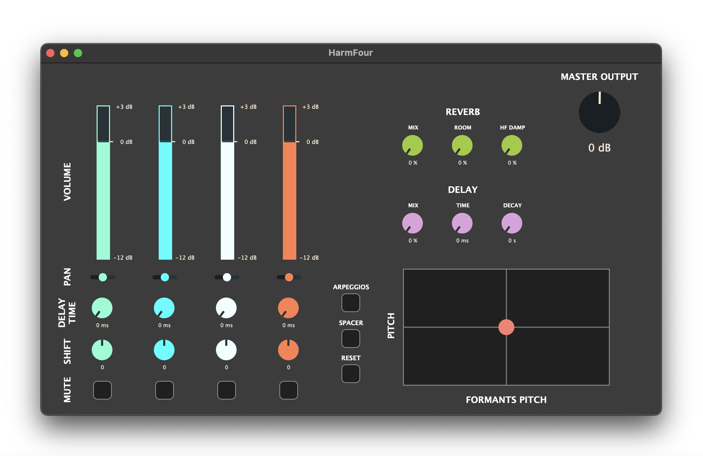

# HarmFour

## CMLS Homerwork 3

* 10800970
* 10823661
* 10529136

## Introduction

HarmFour is a Voice Harmonizer implemented with SuperCollider and can perform an OSC communication with the GUI built with the JUCE framework and a Syntien OSC app (controls only the trackpad of the JUCE's GUI).

Its main features are:

* 4 different voices.
* PSOLA method and 2 octaves of shifting.
* Delay and Reverb effects.
* Automatic arpeggios and spacer
* Interactive trackpad.

## Setup

Download the files available in this page.

The source code of the Harmonizer is inside the folder "SuperCollider", while the GUI's file "HarmFour.exe" is already executable. In order to use also the "Syntien" app, it is necessary to install it on your smartphone.
The Vocal Harmonizer captures the signals coming from the microphone of your computer.

## Interface

* **Single voice controls:** adjust the main parameters of each voice.

* **Automatic Delay and Shift adjustment:** performs arpeggios and chorus effects.

* **Master Effects:** controls the reverb and the delay.

* **Master Outputs:** controls the gain of the output .

* **TrackPad:** performs pitch and formants shifts along with the knobs.

## Features

### Pitch-shift

The pitch-shifting is performed using a Pitch-Synchronous Overlap and Add (PSOLA) method, that allows an independent control over pitch and formants shifting.

The user can adjust the shifting combining both the use of knobs (they are independent for each of the four voices) and the use of the trackpad (shared between all the voices).
The trackpad can be also controlled by an external 

### Effects

Reverb and delay are implemented using functions already existing in Supercollider and busses are setted to work in a more efficient way.
For each effect, the user can modify 3 parameters:
* **Reverb:** mix (amount of reverb), room (dimension of the chamber simulated), damping (brightness of the reverb).
* **Delay:** mix (amplitude of replicas), time (distance between repetitions), decay (time taken to vanish the delay effect). 

### Arpeggios and Spacer

These buttons can adjust the Delay and Shift values automatically.

The Arpeggiator creates an arpeggiated version of the input source, fixing the first voice as the root of the arpeggio, and modifying the other voices in a bounded-random way.

The Spacer tries to give the perception of a chorus sound and it is performed by adjusting both the shifts and the delays of each voice.

### OSC Receiver

Through OSC communication are sent OSC messages from the GUI to SuperCollider.
Different OSCDef objects intercept OSC messages and use the name of the parameters declared in the GUI in order to retrieve the value associated with them.

Namely, the OSCDef that have been defined are: 4 independent voices (with all the parameters related to the GUI), a Master Volume, 2 Trackpad (one related to X axis, the other related to Y axis), 6 Effects (three for the master reverb and three for the master delay).
